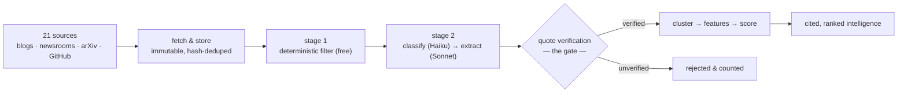

<div align="center">

# Frontier Lab Intelligence

**Tracks what frontier AI labs and their researchers actually ship, turns it into
cited, ranked intelligence — and refuses to store anything it cannot prove.**


*Built as a take-home case study for **BIT Capital**, a Berlin technology fund.*

</div>

---

## Table of contents

- [The one idea](#the-one-idea)
- [How it works](#how-it-works)
- [Highlights](#highlights)
- [Quick start](#quick-start)
- [CLI reference](#cli-reference)
- [Project layout](#project-layout)
- [Two decisions worth knowing about](#two-decisions-worth-knowing-about)
- [Stated limitations](#stated-limitations)
- [Documentation](#documentation)

---

## The one idea

> **Nothing enters the system without evidence, and nothing survives that cannot
> be re-verified against the bytes it came from.**

Every insight carries an `evidence_id` (`NOT NULL`). Every quote is re-checked
against the stored document — not at write time, but again on every validation
run. If a source edits a page, or a bad extraction slipped through once, the
check battery says so.

That single invariant is why the numbers below can be trusted, and it is the
reason the honest quote-verification rate went **down** from 99.8% to 95.5%
when a bug was fixed: the old figure was high because failures were not being
counted.

## How it works



Current corpus: **406 events** from 361 documents, 1,514 evidence rows, across
**7 tracked labs** (OpenAI, Anthropic, Google DeepMind, Meta AI, Mistral,
DeepSeek, Qwen).

## Highlights

| | |
|---|---|
| **Evidence-gated extraction** | Every LLM-extracted claim must carry a verbatim 10–60-word quote that re-matches the stored bytes. Unverified quotes are discarded *and counted* — the hallucination-control number is printed on every run. |
| **A register, not a list** | Labs are first-class entities; people are discovered by arXiv co-author expansion, corroborated across platforms (`identities` with confidence tiers), and re-observed daily. Approvals are versioned; manual overrides survive DB rebuilds. |
| **Scoring that earns its weights** | No arbitrary weighted sum: a 5-model bake-off (recency & corroboration baselines, hand-weights, logistic, GBM) on held-out pairwise labels. Lab identity is **never** a feature; per-lab precision@10 is the fairness check. |
| **Reliability without ground truth** | An LLM pairwise judge (versioned prompts r1→r4) plus six deterministic labeling functions, with Dawid–Skene estimating every labeler's accuracy from disagreement alone. |
| **Cost-controlled by design** | A cheap Haiku gate kills non-substantive documents before Sonnet sees them. Every call is logged to `llm_calls` (model, tokens, $). `--max-extract` caps spend per run. |
| **A validation battery, not vibes** | C1–C17 invariant checks run after every pipeline; the exit code *is* the verdict. `tests/test_architecture.py` fails the build if a lower layer imports a higher one. |

## Quick start

```bash
python3 -m venv .venv && source .venv/bin/activate   # Windows: .venv\Scripts\activate
pip install -r requirements.txt
echo "ANTHROPIC_API_KEY=sk-..." > .env

python3 -m fli.cli pipeline      # the full daily cycle
python3 -m fli.cli checks        # invariant battery; exit 0 = green
python3 -m unittest discover -s tests -t .
```

> [!NOTE]
> Without an API key everything deterministic still runs and stays green —
> only LLM extraction is skipped.

Full operational detail in [RUNNING.md](RUNNING.md).

## CLI reference

One entry point, one command per layer — every layer also runs alone.

| Command | Layer | What it does |
|---|---|---|
| `ingest` | L1 | Fetch all feeds, store immutably, hash-dedupe |
| `x` | L1 | X/social ingestion (paid; `--dry-run` first) |
| `filter` | L2 | Stage-1 deterministic filter (free) |
| `register` | L2 | Approve / reject / inspect tracked people |
| `expand` | L2 | arXiv co-author discovery from research seeds |
| `cluster` | L3 | Jaccard clustering (`--histogram` shows the measured θ) |
| `features` | L3 | Build the ML feature surface |
| `label` | L3 | Human pairwise labeling (`--audit` for the audit pass) |
| `judge` | L3 | LLM pairwise judge (**spends**; `--dry-run` previews) |
| `weak` | L3 | Labeling functions + Dawid–Skene ($0) |
| `score` | L3 | The scoring bake-off (`--bakeoff`) |
| `evaluate` | — | Figures + evaluation report |
| `checks` | — | C1–C17 invariant battery |
| `pipeline` | — | The full daily cycle |
| `skeleton` | — | One doc → one insight, end to end |

```bash
python -m fli.cli <command> --help   # each layer's own options
```

## Project layout

Packages mirror the data model, so the code map and the schema are the same
picture.

```
fli/core/           text, http, config, paths, policy
fli/storage/        SQLite persistence — no domain logic
fli/ingestion/      LAYER 1  raw sources
fli/knowledge/      LAYER 2  filtering, extraction, register
fli/intelligence/   LAYER 3  clustering, features, labels, scoring
fli/ops/            LLM client, tracing (cross-cutting)
fli/validation/     C1–C17 invariant battery
fli/orchestration/  pipeline, skeleton — composition only
```

Layers communicate **only through the database**, which is what makes each one
runnable and testable on its own.

## Two decisions worth knowing about

**Editorial policy is configuration, not code.** What counts as
"decision-relevant" is a business judgement, and the author of this repository
is an engineer, not a portfolio manager. So it lives in
[config/policy.yml](config/policy.yml) with a named owner, a version, and its
provenance in BIT's own published theses. Every scored event records the policy
version that produced it. The code contains no business judgement, and the
owner field currently reads `unassigned` — which the system prints on every run
rather than hiding.

**Importance is not treated as ground truth.** Nobody here can credibly say
which of two events matters more to a fund. Rather than pretend otherwise, the
system records *who* made each judgement — an LLM, a human, or a weak labeling
function — and estimates their reliability from disagreement. What is validated
is the *instrument*: how many judgements it takes to recover a known policy, and
how much annotator noise it tolerates.

## Stated limitations

Kept here rather than buried, because a system that hides its boundaries is not
an intelligence system.

- **Person attribution resolves on 1 of 406 events.** The register, expansion
  and approval machinery works, but the corpus rarely names individuals.
- **`personnel` events are 2 of 406 (0.5%).** The policy ranks them highly; the
  sources barely produce them.
- **Some launches are behind JavaScript.** Those pages are captured manually and
  stored under the same immutability rules, rather than weakening the evidence
  invariant to accommodate them.
- **The policy has no domain owner.** Every weight in `policy.yml` is
  provisional until one signs off, and the system says so on every run.

## Documentation

| File | What it covers |
|---|---|
| [RUNNING.md](RUNNING.md) | How to run every layer |
| [docs/hld.mermaid](docs/hld.mermaid) | High-level design |
| [docs/erd.mermaid](docs/erd.mermaid) | Data model |
| [storage/schema.sql](storage/schema.sql) | The authoritative schema, commented |
| [config/policy.yml](config/policy.yml) | The editorial policy — versioned, owned |

