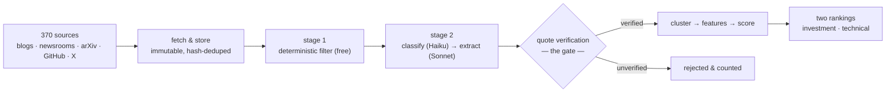

<div align="center">

# Frontier Lab Intelligence

**Tracks what frontier AI labs and their researchers actually ship, turns it into
cited, ranked intelligence — and refuses to store anything it cannot prove.**


*Built for a technology investment fund tracking frontier-lab activity.*

</div>

---

## Table of contents

- [The one idea](#the-one-idea)
- [How it works](#how-it-works)
- [Highlights](#highlights)
- [Quick start](#quick-start)
- [CLI reference](#cli-reference)
- [Project layout](#project-layout)
- [Two decisions worth knowing about](#two-decisions-worth-knowing-about)
- [Stated limitations](#stated-limitations)
- [Documentation](#documentation)

---

## The one idea

> **Nothing enters the system without evidence, and nothing survives that cannot
> be re-verified against the bytes it came from.**

Every insight carries an `evidence_id` (`NOT NULL`). Every quote is re-checked
against the stored document — not at write time, but again on every validation
run. If a source edits a page, or a bad extraction slipped through once, the
check battery says so.

## How it works



Current corpus: **734 events** from 1,541 documents, 2,294 evidence rows, across
**8 tracked labs** (OpenAI, Anthropic, Google DeepMind, Meta AI, Mistral,
DeepSeek, Qwen, xAI) and 285 tracked people resolved across arXiv, X, GitHub
and lab pages.

## Highlights

| | |
|---|---|
| **Evidence-gated extraction** | Every LLM-extracted claim must carry a verbatim 10–60-word quote that re-matches the stored bytes. Unverified quotes are discarded *and counted* — the hallucination-control number is printed on every run. |
| **A register, not a list** | Labs are first-class entities; people are discovered by arXiv co-author expansion, corroborated across platforms (`identities` with confidence tiers), and re-observed daily. Approvals are versioned; manual overrides survive DB rebuilds. |
| **Two audiences, two rankings** | The investment reader asks "what does this mean for our positions?"; the AI team asks "what should we adopt?". Both definitions of *important* live in [config/rubrics/](config/rubrics/), and each trains its own model. Measured, the two rankings share **0 of their top 10** and correlate at **Kendall τ = +0.064** — near zero, so one ranking demonstrably cannot serve both. |
| **Scoring that earns its weights** | No arbitrary weighted sum: a 5-model bake-off (recency & corroboration baselines, hand-weights, logistic, GBM) on held-out pairwise labels. Lab identity is **never** a feature; per-lab precision@10 is the fairness check, and labs with too few events are excluded rather than given a meaningless score. |
| **Reliability without ground truth** | Two independent model families (Claude and GPT) plus a human auditor judge the identical pairs; Dawid–Skene estimates each labeler's accuracy from their disagreement alone — 0.874, 0.864 and 0.778. The human's *lower* score is itself a finding: human sittings deliberately target the pairs where the models disagree, and a disagreement-based estimator reads that as inaccuracy — which is why the human agreement is reported alongside, never replaced by, the model estimate. The figure refuses to render from a single family, because one model agreeing with itself measures nothing. |
| **Cost-controlled by design** | A cheap Haiku gate kills non-substantive documents before Sonnet sees them. Every call is logged to `llm_calls` (model, tokens, $). `--max-extract` caps spend per run. |
| **A validation battery, not vibes** | C1–C20 invariant checks run after every pipeline; the exit code *is* the verdict. `tests/test_architecture.py` fails the build if a lower layer imports a higher one. |

## Quick start

```bash
python3 -m venv .venv && source .venv/bin/activate   # Windows: .venv\Scripts\activate
pip install -r requirements.txt
echo "ANTHROPIC_API_KEY=sk-..." > .env

python3 -m fli.cli pipeline      # the full daily cycle
python3 -m fli.cli checks        # invariant battery; exit 0 = green
python3 -m unittest discover -s tests -t .
```

> [!NOTE]
> Without an API key everything deterministic still runs and stays green —
> only LLM extraction is skipped.

Full operational detail in [RUNNING.md](RUNNING.md).

## CLI reference

One entry point, one command per layer — every layer also runs alone.

| Command | Layer | What it does |
|---|---|---|
| `ingest` | L1 | Fetch all feeds, store immutably, hash-dedupe |
| `x` | L1 | X/social ingestion (paid; `--dry-run` first) |
| `filter` | L2 | Stage-1 deterministic filter (free) |
| `register` | L2 | Approve / reject / inspect tracked people |
| `expand` | L2 | arXiv co-author discovery from research seeds |
| `cluster` | L3 | Jaccard clustering (`--histogram` shows the measured θ) |
| `features` | L3 | Build the ML feature surface |
| `label` | L3 | Human pairwise labeling (`--audit` for the audit pass) |
| `judge` | L3 | LLM pairwise judge (**spends**; `--dry-run` previews). `--rubric` picks the audience, `--model` a second provider, `--agreement` reports Cohen's κ ($0) |
| `channels` | L3 | LLM channel classifier over the corpus |
| `score` | L3 | Bake-off and ranking (`--all-rubrics`, `--top K --rubric NAME`) |
| `contributors` | L3 | Rank tracked people by their linked events' validated scores (`--review` for keep/cut) |
| `xbench` | — | The frozen X reference set used by the evaluation figures ($0) |
| `evaluate` | — | Figures + evaluation report |
| `checks` | — | C1–C20 invariant battery |
| `drift` | — | PSI/KS corpus drift vs history ($0; monitoring, never gates the build) |
| `verify` | — | Claim↔quote entailment check over all insights (`--repair` rewrites `partial` claims to what their quote supports) |
| `positions` | L4 | Map events to holdings (ticker + mechanism edges) |
| `personas` | L4 | Per-audience readings (threat/tailwind · adopt/investigate) |
| `digest` | L4 | Periodic digest, Markdown + PDF (`--review` for keep/cut) |
| `alerts` | L4 | Push material events to a sink (fires on signed direction) |
| `web` | — | Web UI over the DB (browse + candidate approve/reject) |
| `pipeline` | — | The full daily cycle (free stages) |
| `graph` | — | The same run as a LangGraph graph, paid stages included behind `--spend`. `--mermaid` prints the topology and runs nothing |
| `skeleton` | — | One doc → one insight, end to end |

```bash
python -m fli.cli <command> --help   # each layer's own options
```

## Project layout

Packages mirror the data model, so the code map and the schema are the same
picture.

```
fli/core/           text, http, config, paths, policy, rubrics
fli/storage/        SQLite persistence — no domain logic
fli/ingestion/      LAYER 1  raw sources
fli/knowledge/      LAYER 2  filtering, extraction, register
fli/intelligence/   LAYER 3  clustering, features, labels, scoring
fli/ops/            LLM client, tracing (cross-cutting)
fli/validation/     C1–C20 invariant battery
fli/orchestration/  pipeline, skeleton — composition only
```

Layers communicate **only through the database**, which is what makes each one
runnable and testable on its own.

## Two decisions worth knowing about

**Editorial policy is configuration, not code.** What counts as
"decision-relevant" is a business judgement, so it is configurable by the fund
manager rather than hard-coded. It lives in
[config/policy.yml](config/policy.yml) with a named owner, a version, and its
provenance in the fund's own published materials. Every scored event records the policy
version that produced it, so any ranking can be traced back to the rules behind
it. The owner field currently reads `unassigned` — which the system prints on
every run rather than hiding.

**Importance is not treated as ground truth.** Nobody can credibly say which of
two events matters more to a fund. Rather than pretend otherwise, the system
records *who* made each judgement and under *which rubric* — the labeler id is
`llm:<model>/<rubric>/r<version>` — and estimates reliability from disagreement
between independent model families. Judgements made under different rubrics are
never pooled, because two audiences disagreeing is the product, not noise.

## Stated limitations

Kept here rather than buried, because a system that hides its boundaries is not
an intelligence system.

- **Person linkage reaches 58 of 734 events** — 14 attributed to a person as the
  event's subject, plus 44 linked deterministically to tracked arXiv authors
  (`extract --backfill-authors`, role `author`, never inflated into subject
  attribution). The register, expansion and approval machinery works, but
  official channels rarely name individuals outside paper bylines.
- **`personnel` events are 8 of 734 (1.1%).** Rare, but they include two xAI
  co-founder departures and a 30-person acquihire into Mistral — the signals the
  fund most wants, found only after researcher X accounts were added.
- **Live mobility synthesis has not fired yet.** The mechanism is test-verified
  end to end (a planted move reaches the digest slate), but re-observation runs
  on a 7-day cadence and the first observation landed Jul 30 — the earliest a
  real move can be witnessed is Aug 6.
- **Roughly a quarter of pairwise verdicts come back low-confidence** (27.5%
  Claude, 22.0% GPT) and are excluded from training. That is the judge reporting
  when a pair is genuinely inseparable, not a defect — but it cuts usable label
  yield.
- **Some launches are behind JavaScript.** Those pages are captured manually and
  stored under the same immutability rules, rather than weakening the evidence
  invariant to accommodate them.
- **The policy has no domain owner.** Every weight in `policy.yml` is
  provisional until one signs off, and the system says so on every run.

## Documentation

Start with the final report — it is the answer to "did this surface something
worth knowing, and did it keep the noise out?"

| File | What it covers |
|---|---|
| [docs/final-report.md](docs/final-report.md) | **What the system actually found** — five real insights, the honest negatives, what's next |
| [docs/architecture.md](docs/architecture.md) | The stack and why · model selection per task · fallback strategies |
| [docs/evaluation.md](docs/evaluation.md) | Extraction quality, hallucination control, scoring validation, the ground-truth approach |
| [docs/evaluation-report.md](docs/evaluation-report.md) | Every figure, regenerated by one command ($0, DB-only) |
| [docs/tokenomics.md](docs/tokenomics.md) | Tokens and $ per workflow, and how cost shaped model choice |
| [docs/prompts.md](docs/prompts.md) | Every prompt, quoted from the code, with its design rationale |
| [RUNNING.md](RUNNING.md) | How to run every layer |
| [docs/design-notes.md](docs/design-notes.md) | Why the code is shaped this way — every non-obvious decision, keyed by module |
| [docs/labeling-rubric.md](docs/labeling-rubric.md) | What makes an event decision-relevant, sourced to BIT's own published materials |
| [docs/scoring-without-ground-truth.md](docs/scoring-without-ground-truth.md) | The position taken when no gold labels exist |
| [docs/hld.mermaid](docs/hld.mermaid) | High-level design |
| [docs/erd.mermaid](docs/erd.mermaid) | Data model |
| [storage/schema.sql](storage/schema.sql) | The authoritative schema, commented |
| [config/policy.yml](config/policy.yml) | The editorial policy — versioned, owned |
| [config/rubrics/](config/rubrics/) | What *important* means, one file per audience |
| [docs/digests/](docs/digests/) | Delivered digests, Markdown + PDF, both personas |

