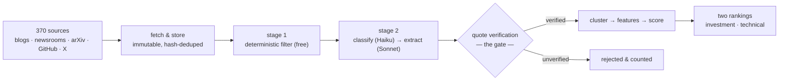

<div align="center">

# Frontier Lab Intelligence

**An evidence-driven intelligence system for frontier AI labs: it tracks what the
labs and their researchers actually ship, and turns it into cited, ranked,
audience-tailored intelligence.**


*Every event is evidenced, every score is justified, and the whole tracked
universe is a YAML file.*

</div>

---

## Table of contents

- [The one idea](#the-one-idea)
- [How it works](#how-it-works)
- [Highlights](#highlights)
- [The stack](#the-stack)
- [Configure it for your fund](#configure-it-for-your-fund)
- [Quick start](#quick-start)
- [CLI reference](#cli-reference)
- [Project layout](#project-layout)
- [Two decisions worth knowing about](#two-decisions-worth-knowing-about)
- [Stated limitations](#stated-limitations)
- [Documentation](#documentation)

---

## The one idea

> **Nothing enters the system without evidence, and nothing survives that cannot
> be re-verified against the bytes it came from.**

Every insight carries an `evidence_id` (`NOT NULL`). Every quote is re-checked
against the stored document — not at write time, but again on every validation
run. If a source edits a page, or a bad extraction slipped through once, the
check battery says so.

The data model is an **event spine**: a fetched document yields evidence, evidence
yields an event, and everything downstream — clustering, features, scores,
holding exposure, the per-audience reading, the digest, the alert — hangs off
that one event row and can be traced back through it to the bytes a lab
published. Layers never call each other in memory; they communicate through the
database, which is what lets any stage run, and be inspected, on its own.

## How it works



Current corpus: **734 events** from 1,541 documents, 2,294 evidence rows, across
**8 tracked labs** (OpenAI, Anthropic, Google DeepMind, Meta AI, Mistral,
DeepSeek, Qwen, xAI) and 285 tracked people resolved across arXiv, X, GitHub
and lab pages.

## Highlights

| | |
|---|---|
| **Evidence-gated extraction** | Every LLM-extracted claim must carry a verbatim 10–60-word quote that re-matches the stored bytes. Unverified quotes are discarded *and counted* — the hallucination-control number is printed on every run. |
| **A register, not a list** | Labs are first-class entities; people are discovered by arXiv co-author expansion, corroborated across platforms (`identities` with confidence tiers), and re-observed daily. Approvals are versioned; manual overrides survive DB rebuilds. |
| **Two audiences, two rankings** | The investment reader asks "what does this mean for our positions?"; the AI team asks "what should we adopt?". Both definitions of *important* live in [config/rubrics/](config/rubrics/), and each trains its own model. Measured, the two rankings share **0 of their top 10** and correlate at **Kendall τ = +0.064** — near zero, so one ranking demonstrably cannot serve both. |
| **Scoring that earns its weights** | No arbitrary weighted sum: a 5-model bake-off (recency & corroboration baselines, hand-weights, logistic, GBM) on held-out pairwise labels. Lab identity is **never** a feature; per-lab precision@10 is the fairness check, and labs with too few events are excluded rather than given a meaningless score. |
| **Reliability without ground truth** | Two independent model families (Claude and GPT) plus a human auditor judge the identical pairs; Dawid–Skene estimates each labeler's accuracy from their disagreement alone — 0.874, 0.864 and 0.778. The human's *lower* score is itself a finding: human sittings deliberately target the pairs where the models disagree, and a disagreement-based estimator reads that as inaccuracy — which is why the human agreement is reported alongside, never replaced by, the model estimate. The figure refuses to render from a single family, because one model agreeing with itself measures nothing. |
| **Cost-controlled by design** | A cheap Haiku gate kills non-substantive documents before Sonnet sees them. Every call is logged to `llm_calls` (model, tokens, $). `--max-extract` caps spend per run, and the graph *pauses* before any paid stage — showing how much unaudited work is actually pending — so approval is an informed decision rather than a flag set hours earlier. |
| **Three ways to read it, one source of truth** | A CLI, a Flask web UI, and a read-only MCP server that hands an agent the same slate, claim search, drift status and digests. Every surface calls the same layer functions, so none of them can re-derive a different answer. |
| **A validation battery, not vibes** | C1–C20 invariant checks run after every pipeline and the exit code *is* the verdict — quotes re-verify, every person is evidenced, no evidence is orphaned, scores cite a live policy version. Layer boundaries are enforced at build time, so presentation can never reach back and change what was extracted. |
| **Drift monitoring that stays out of the way** | PSI over categorical mixes and a two-sample KS test over continuous ones, computed straight from SQL at $0. Deliberately *not* an invariant — an organic news cycle must not turn the build red — but it exits with the count of MAJOR drifts so a scheduler can alarm. On the current corpus it caught the event type feeding the technical top 10 going to zero in the latest window. |

## The stack

Small on purpose. Everything past the first four rows is optional and lazily
imported, so the daily run works on a machine that has none of it installed.

| | | why |
|---|---|---|
| **Python 3** | runtime | no framework; the layers are plain modules |
| **SQLite** | storage | right size for a single-writer daily pipeline, and it makes the deliverable a file you can open |
| **Anthropic SDK** (Claude) | classify · extract · repair · judge · persona | Sonnet where a wrong answer becomes a stored fact, Haiku where it only costs a re-check |
| **OpenAI SDK** (GPT) | second judge family | reliability estimates need conditionally independent labelers, not two prompts of one model |
| **Pydantic** | typed model I/O | model replies are validated into schemas; a reply that omits its working is rejected, not stored |
| **scikit-learn** | scoring bake-off | SQL + sklearn over a few hundred rows. No vector store, no embeddings — they would be infrastructure carrying no measurement |
| **LangGraph** | run orchestration | the whole run as one graph, with the paid stages behind a human approval the graph pauses on |
| **Phoenix / OpenInference** | tracing | `graph.run → node.<stage> → llm.<task>` in one tree; off by default |
| **Flask** | web UI | a light read surface over the same database |
| **MCP SDK** | agent surface | the same slate, search, drift and digests as read-only tools over stdio, for Claude Desktop or an IDE agent |
| **matplotlib · seaborn · pandas** | figures | regenerated by one command, $0 |

## Configure it for your fund

The core is **evidence- and event-driven**, and deliberately knows nothing about
any particular fund. What makes it *this* fund's system is four YAML files:

| file | what it decides |
|---|---|
| [config/register_seeds.yml](config/register_seeds.yml) | which labs and people to track, and the pages that evidence them — your data sources |
| [config/policy.yml](config/policy.yml) | `channels` (how a lab event reaches a portfolio — general to any technology fund) and `positions` (which holdings exist, and the vocabulary indicating exposure — fund-specific) |
| [config/rubrics/](config/rubrics/) | what *important* means, one file per audience |
| [config/register_overrides.yml](config/register_overrides.yml) | manual corrections that survive a database rebuild |

That split is the design, not a happy accident — `policy.yml` says so in its own
comments: *"Swap this `positions` block for another fund and the system works
unchanged."* Point `register_seeds.yml` at a different set of labs and the same
pipeline tracks a different universe, with no code change.

**Portability.** There is nothing cloud-specific anywhere: state is one SQLite
file, the runtime is plain Python, and model routing is a single dictionary in
`fli/ops/llm.py`. Today it runs four ways: as a CLI, as a Flask UI, as an MCP
server an agent client can call, and as a scheduled
[GitHub Actions](.github/workflows/pipeline.yml) job that commits the updated
database and report back to the repository. Other targets — Vertex AI or Bedrock
inference, a container image — are not implemented; what stands between the
system and them is recorded under
[future scope](docs/final-report.md#future-scope).

## Quick start

```bash
python3 -m venv .venv && source .venv/bin/activate   # Windows: .venv\Scripts\activate
pip install -r requirements.txt
cp .env.example .env             # fill in ANTHROPIC_API_KEY; everything else is optional

python3 -m fli.cli pipeline      # the full daily cycle
python3 -m fli.cli graph         # the same run as one graph (--spend adds the paid stages)
python3 -m fli.cli checks        # invariant battery; exit 0 = green
python3 -m fli.cli web           # browse the register, scores and past reports
python3 -m fli.cli mcp           # serve the same intelligence to an agent client
```

> [!NOTE]
> Without an API key everything deterministic still runs and stays green —
> only the LLM stages are skipped. The committed database ships with real data,
> so a clone reproduces every reported number without spending anything.

Full operational detail in [RUNNING.md](RUNNING.md).

## CLI reference

One entry point, one command per layer — every layer also runs alone.

| Command | Layer | What it does |
|---|---|---|
| `ingest` | L1 | Fetch all feeds, store immutably, hash-dedupe |
| `x` | L1 | X/social ingestion (paid; `--dry-run` first) |
| `filter` | L2 | Stage-1 deterministic filter (free) |
| `register` | L2 | Approve / reject / inspect tracked people |
| `expand` | L2 | arXiv co-author discovery from research seeds |
| `cluster` | L3 | Jaccard clustering (`--histogram` shows the measured θ) |
| `features` | L3 | Build the ML feature surface |
| `label` | L3 | Human pairwise labeling (`--audit` for the audit pass) |
| `judge` | L3 | LLM pairwise judge (**spends**; `--dry-run` previews). `--rubric` picks the audience, `--model` a second provider, `--agreement` reports Cohen's κ ($0) |
| `channels` | L3 | LLM channel classifier over the corpus |
| `score` | L3 | Bake-off and ranking (`--all-rubrics`, `--top K --rubric NAME`) |
| `contributors` | L3 | Rank tracked people by their linked events' validated scores (`--review` for keep/cut) |
| `xbench` | — | The frozen X reference set used by the evaluation figures ($0) |
| `evaluate` | — | Figures + evaluation report |
| `checks` | — | C1–C20 invariant battery |
| `drift` | — | PSI/KS corpus drift vs history ($0; monitoring, never gates the build) |
| `verify` | — | Claim↔quote entailment check over all insights (`--repair` rewrites `partial` claims to what their quote supports) |
| `positions` | L4 | Map events to holdings (ticker + mechanism edges) |
| `personas` | L4 | Per-audience readings (threat/tailwind · adopt/investigate) |
| `digest` | L4 | Periodic digest, Markdown + PDF (`--review` for keep/cut) |
| `alerts` | L4 | Push material events to a sink (fires on signed direction) |
| `web` | — | Web UI over the DB (browse + candidate approve/reject) |
| `mcp` | L4 | Read-only MCP server over stdio: slate, claim search, drift, digests |
| `pipeline` | — | The full daily cycle (free stages) |
| `graph` | — | The same run as a LangGraph graph, paid stages included behind `--spend` + an approval pause (`--yes` to skip it). `--mermaid` prints the topology and runs nothing |
| `skeleton` | — | One doc → one insight, end to end |

```bash
python -m fli.cli <command> --help   # each layer's own options
```

## Project layout

Packages mirror the data model, so the code map and the schema are the same
picture.

```
fli/core/           text, http, config, paths, policy, rubrics
fli/storage/        SQLite persistence — no domain logic
fli/ingestion/      LAYER 1  raw sources
fli/knowledge/      LAYER 2  filtering, extraction, register
fli/intelligence/   LAYER 3  clustering, features, labels, scoring
fli/ops/            LLM client, tracing (cross-cutting)
fli/validation/     C1–C20 invariant battery
fli/orchestration/  pipeline, skeleton — composition only
```

Layers communicate **only through the database**, which is what makes each one
runnable and testable on its own.

## Two decisions worth knowing about

**Editorial policy is configuration, not code.** What counts as
"decision-relevant" is a business judgement, so it is configurable by the fund
manager rather than hard-coded. It lives in
[config/policy.yml](config/policy.yml) with a named owner, a version, and its
provenance in the fund's own published materials. Every scored event records the policy
version that produced it, so any ranking can be traced back to the rules behind
it. The owner field currently reads `unassigned` — which the system prints on
every run rather than hiding.

**Importance is not treated as ground truth.** Nobody can credibly say which of
two events matters more to a fund. Rather than pretend otherwise, the system
records *who* made each judgement and under *which rubric* — the labeler id is
`llm:<model>/<rubric>/r<version>` — and estimates reliability from disagreement
between independent model families. Judgements made under different rubrics are
never pooled, because two audiences disagreeing is the product, not noise.

## Stated limitations

Kept here rather than buried, because a system that hides its boundaries is not
an intelligence system. What it would take to close each of these is collected
in [future scope](docs/final-report.md#future-scope).

- **Person linkage reaches 58 of 734 events** — 14 attributed to a person as the
  event's subject, plus 44 linked deterministically to tracked arXiv authors
  (`extract --backfill-authors`, role `author`, never inflated into subject
  attribution). The register, expansion and approval machinery works, but
  official channels rarely name individuals outside paper bylines.
- **`personnel` events are 8 of 734 (1.1%).** Rare, but they include two xAI
  co-founder departures and a 30-person acquihire into Mistral — the signals the
  fund most wants, found only after researcher X accounts were added.
- **Live mobility synthesis has not fired yet.** The mechanism is test-verified
  end to end (a planted move reaches the digest slate), but re-observation runs
  on a 7-day cadence and the first observation landed Jul 30 — the earliest a
  real move can be witnessed is Aug 6.
- **Roughly a quarter of pairwise verdicts come back low-confidence** (27.5%
  Claude, 22.0% GPT) and are excluded from training. That is the judge reporting
  when a pair is genuinely inseparable, not a defect — but it cuts usable label
  yield.
- **Some launches are behind JavaScript.** Those pages are captured manually and
  stored under the same immutability rules, rather than weakening the evidence
  invariant to accommodate them.
- **The policy has no domain owner.** Every weight in `policy.yml` is
  provisional until one signs off, and the system says so on every run.

## Documentation

Start with the final report — it is the answer to "did this surface something
worth knowing, and did it keep the noise out?"

| File | What it covers |
|---|---|
| [docs/final-report.md](docs/final-report.md) | **What the system actually found** — six real insights, the honest negatives, and future scope |
| [docs/architecture.md](docs/architecture.md) | The stack and why · model selection per task · fallback strategies |
| [docs/evaluation.md](docs/evaluation.md) | Extraction quality, hallucination control, scoring validation, the ground-truth approach |
| [docs/evaluation-report.md](docs/evaluation-report.md) | Every figure, regenerated by one command ($0, DB-only) |
| [docs/tokenomics.md](docs/tokenomics.md) | Tokens and $ per workflow, and how cost shaped model choice |
| [docs/prompts.md](docs/prompts.md) | Every prompt, quoted from the code, with its design rationale |
| [RUNNING.md](RUNNING.md) | How to run every layer |
| [docs/design-notes.md](docs/design-notes.md) | Why the code is shaped this way — every non-obvious decision, keyed by module |
| [docs/labeling-rubric.md](docs/labeling-rubric.md) | What makes an event decision-relevant, sourced to BIT's own published materials |
| [docs/scoring-without-ground-truth.md](docs/scoring-without-ground-truth.md) | The position taken when no gold labels exist |
| [docs/metrics.sql](docs/metrics.sql) → [metrics-out.txt](docs/metrics-out.txt) | The metrics harness and its committed output — every table regenerated by one SQL run |
| [docs/ingestion-robustness-evidence.txt](docs/ingestion-robustness-evidence.txt) | Preserved fetch-failure history (rate limits, timeouts, blocks, empty feeds) exported from a snapshot |
| [docs/hld.mermaid](docs/hld.mermaid) | High-level design |
| [docs/erd.mermaid](docs/erd.mermaid) | Data model |
| [storage/schema.sql](storage/schema.sql) | The authoritative schema, commented |
| [config/policy.yml](config/policy.yml) | The editorial policy — versioned, owned |
| [config/rubrics/](config/rubrics/) | What *important* means, one file per audience |
| [docs/digests/](docs/digests/) | Delivered digests, Markdown + PDF, both personas |

